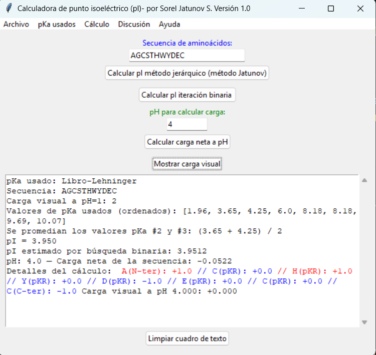

# Calculadora de Punto Isoeléctrico (pI) – Versión 1.0

## ✍ Autor
**Dr. Sorel Jatunov S.** – sjatunov@gmail.com

## 🔧 Requisitos
- Python 3.x
- tkinter (incluido por defecto en la mayoría de instalaciones de Python)

### Calculadora de punto isoeléctrico (pI)



Calculadora educativa de punto isoeléctrico para aminoácidos, péptidos y proteínas.  
Desarrollada por Sorel Jatunov.  
Versión 1.0

### ✨ Inicio rápido para calcular el punto isoeléctrico (pI)

1. **Ingresa la secuencia de aminoácidos** (en código de una letra, p. ej. "ADKWR") en el campo correspondiente.

2. **Selecciona los valores de pKa que deseas utilizar**
Desde el menu -pKa usados puedes seleccionar los siguientes valores de pKa:
   - a) *Libro de Lehninger*: valores experimentales clásicos.
   - b) Valores de pKa modificados del libro de Lehninger (se toman en cuenta que ciertos efectos inductivos se reducen en intensidad con la formación del enlace peptídico)
   - c) Valores customizados.
Mas detalles en la sección: Selección de valores de pKa

3. **Elige el método para obtener el pI** .
   - a) → *Calcular pI método jerárquico (Jatunov)* para estimar el punto isoeléctrico con razonamiento secuencial. Una descripción breve del método jerárquico se encuentra en la sección - Justificación del Método “Jatunov”.
   - b) → *Calcular pI iteración binaria para encontrar el pI mediante una aproximación matemática (basada en la ecuación de Henderson-Hasselbalch), hasta alcanzar una carga neta ≈ 0."

4. **Otras posibilidadas de cálculos son:**

   - c) → *Calcular carga neta a pH* para evaluar la carga de la secuencia.
   - d) → *Mostrar carga visual* para desglosar contribuciones electrostáticas por residuo.
   Estos dos últimos puntos requieren ingresar pH.

---

### 📃 Selección de valores de pKa

Desde el menú superior "**pKa usados**", elige entre:

- *Libro de Lehninger*: tabla de pKa del libro de bioquímica de Lehninger 
- *Lehninger-ajustado*:  Valores de pKa modificados del libro de Lehninger (se toman en cuenta que ciertos efectos inductivos se reducen en intensidad con la formación del enlace peptídico)
- *Personalizado*: cargar valores desde archivo local.

**📁 Ruta del archivo personalizado:**

Cuando usas la opción *Guardar valores pKa personalizados*, el archivo se guarda automáticamente en:

```
[Tu Carpeta de Usuario]/pI_predictor/data/pKa_customizados.txt
```
Ejemplo en Windows:

```
C:\Users\TuNombreUsuario\pI_predictor\data\pKa_customizados.txt
```

**📌 Formato por línea requerido:**

```
K pK1=2.18; pK2=8.95; pKR=10.53
```

Para ello, escribe las líneas correspondientes en el área de salida con el formato requerido, y luego utiliza  *Guardar valores pKa personalizados* que se encuentra en el menú Archivo. En usos posteriores, puedes editar directamente el archivo accediendo a la carpeta indicada o abriendo el archivo desde el menu Archivo - Abrir archivo pKa personalizado.

---

### ⚡ Determinación de la movilidad electroforética

En el menú "**Cálculo**", selecciona:

- *Determinar movimiento electroforético* → aparecerá una ventana para introducir el valor de pI manualmente, y el pH.
- Según la relación entre pH y pI, se indicará si la especie se moverá hacia el ánodo, cátodo o permanecerá estática.

---


## 🧠 Justificación del Método “Jatunov”

El método Jatunov implementado en este simulador didáctico se basa en una lógica alternativa al enfoque tradicional de cálculo del punto isoeléctrico (pI). En lugar de simplemente iterar por valores de pH en búsqueda del punto de carga neta cero, este método:

- Establece primero la carga neta total del péptido a pH 1, donde se asume que la mayoría de grupos ácidos están protonados y los básicos, cargados positivamente.
- Luego, mediante una regla de extrapolación interna, estima el pI desde esa carga inicial, lo que ofrece un resultado más directo, especialmente útil como recurso didáctico.

Es más eficaz para péptidos con aminoácidos variados, pero puede desviarse del valor real en secuencias repetitivas o ricas en un mismo tipo de aminoácido (ej. poliácidos o polibásicos), lo que sirve como punto de discusión crítica en clase.

---

## 🔬 Comparación con el método iterativo tradicional

El simulador también ofrece un método clásico, que:

- Itera de pH 0 a 14 en pasos finos.
- Calcula la carga neta en cada paso con base en la ecuación de Henderson-Hasselbalch, usando los pKa de cada grupo ionizable.
- Detecta el valor de pH en el que la carga neta se aproxima a cero.

Este enfoque es más preciso, pero menos intuitivo para estudiantes que inician en el tema, por lo que el método Jatunov sirve como puente didáctico entre el cálculo empírico y la simulación formal.

---

## 🎯 Valor didáctico de la simulación de carga

Además del cálculo del pI, el simulador incluye una visualización simplificada del comportamiento del péptido en diferentes condiciones de pH. Esto permite que el estudiante:

- Aprenda a asignar cargas positivas o negativas a grupos funcionales.
- Entienda cómo la composición de aminoácidos influye en la movilidad en campo eléctrico.
- Relacione el concepto de pI con aplicaciones prácticas como la electroforesis.

### 📅 Plan futuro

Esta versión 1.0 está diseñada para funcionalidad esencial. En futuras versiones se espera:
- Control del tamaño de las letras.
- Posibilidad de modificar el pKa de ciertos residuos especificos según el entorno en que se encuentren.
- Importación de la secuencia de proteínas.
- Visualización gráfica de carga vs. pH
- Integración de base de datos externa de pKa por contexto estructural
- Exportación de resultados en PDF o Excel

---

## 📜 Licencia

Este proyecto está licenciado bajo la licencia [Creative Commons Atribución-NoComercial 4.0 Internacional (CC BY-NC 4.0)](https://creativecommons.org/licenses/by-nc/4.0/).

Esto significa que:

- ✅ Puedes usar, modificar y compartir este código **con fines no comerciales**.
- ✅ Debes proporcionar **crédito adecuado al autor** (Dr. Sorel Jatunov S.).
- ❌ **No puedes utilizar este trabajo con fines comerciales** sin autorización expresa.
- ✅ Puedes construir sobre este trabajo siempre que mantengas esta misma condición.

Para más detalles, consulta el texto completo de la licencia:  
[https://creativecommons.org/licenses/by-nc/4.0/legalcode](https://creativecommons.org/licenses/by-nc/4.0/legalcode)

---

**Contacto del autor:** sjatunov@gmail.com
